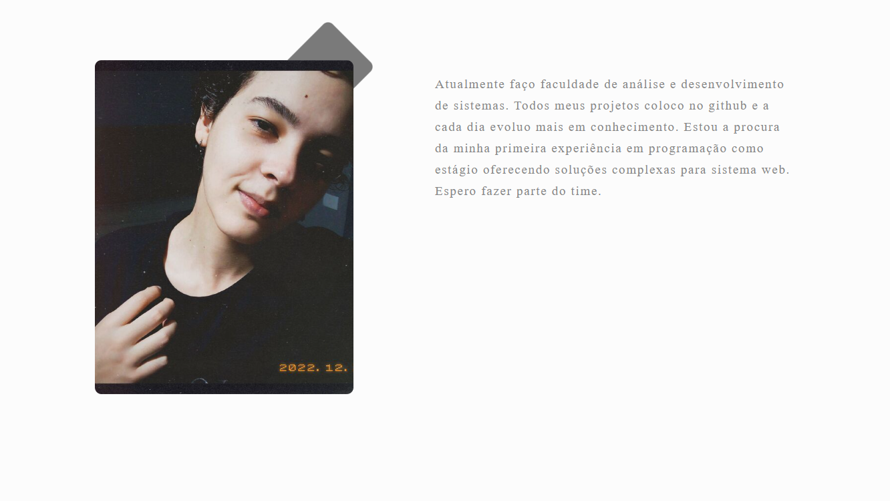

# Personal Web Portfolio Project

I wanted to bring to the image of my portfolio something that I am and carry in my day to day, a philosophy of life minimalist. Right on the home page there is a link to the github portfolio and another button to contact me. A simple idea and straight to the point.

## Index:

- <a href="Presentation">Presentation📃</a>T
- <a href="Technologies">Technologies👩‍💻</a>
- <a href="How to run this project">How to run this project🤔</a>

## Presentation 📃

This is a minimalist portfolio showing a little about what I do, the area I chose to work in and the projects I've done over time. I wanted to bring a minimalist design to be direct to the point without winding up and show about my person, with only two sections.

## Technologies 👩‍💻

- HTML
- CSS
